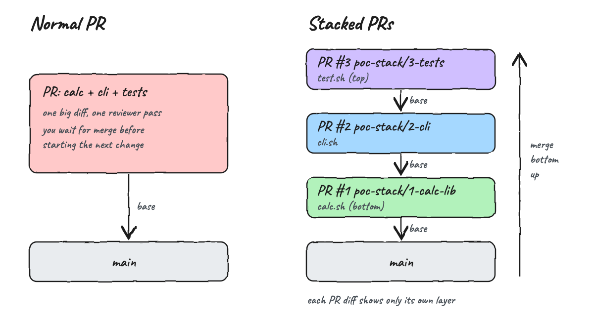
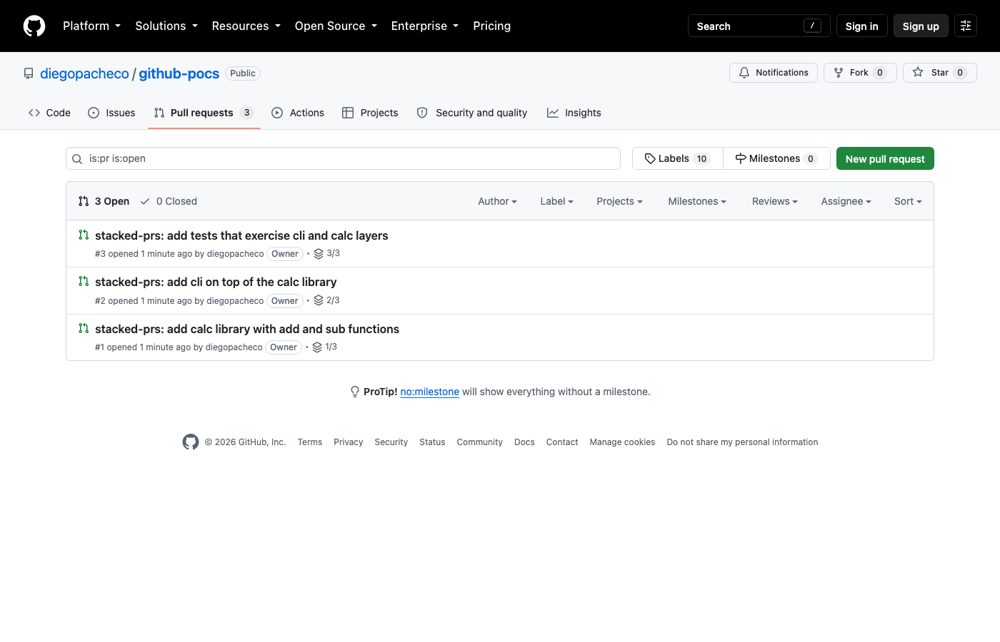
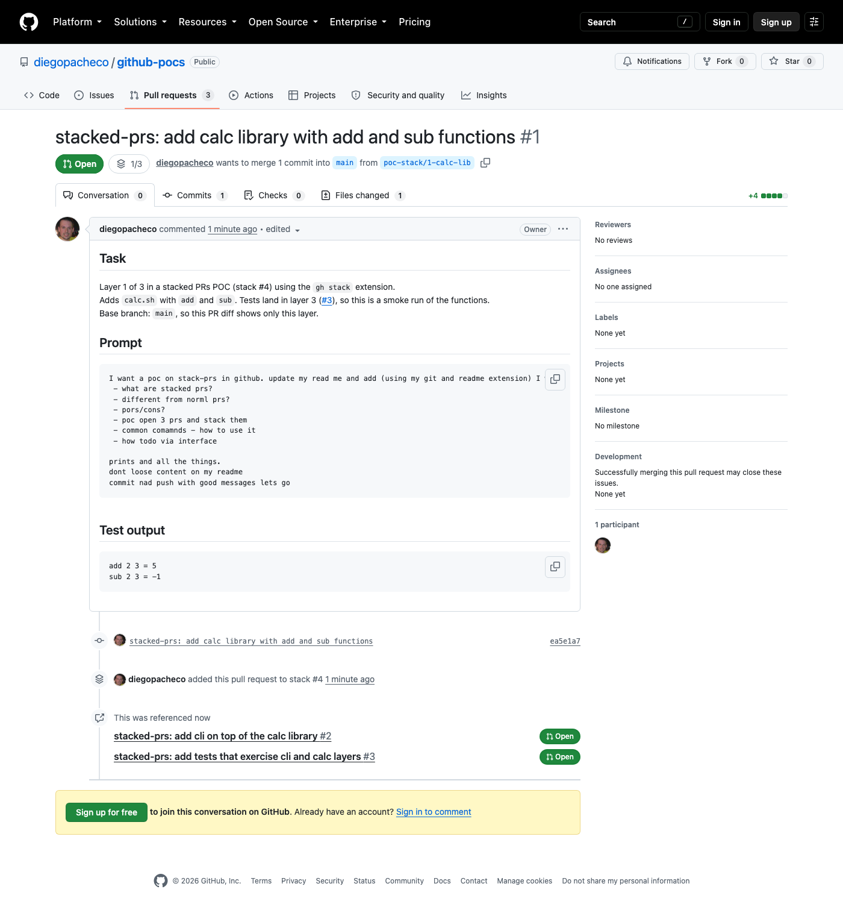
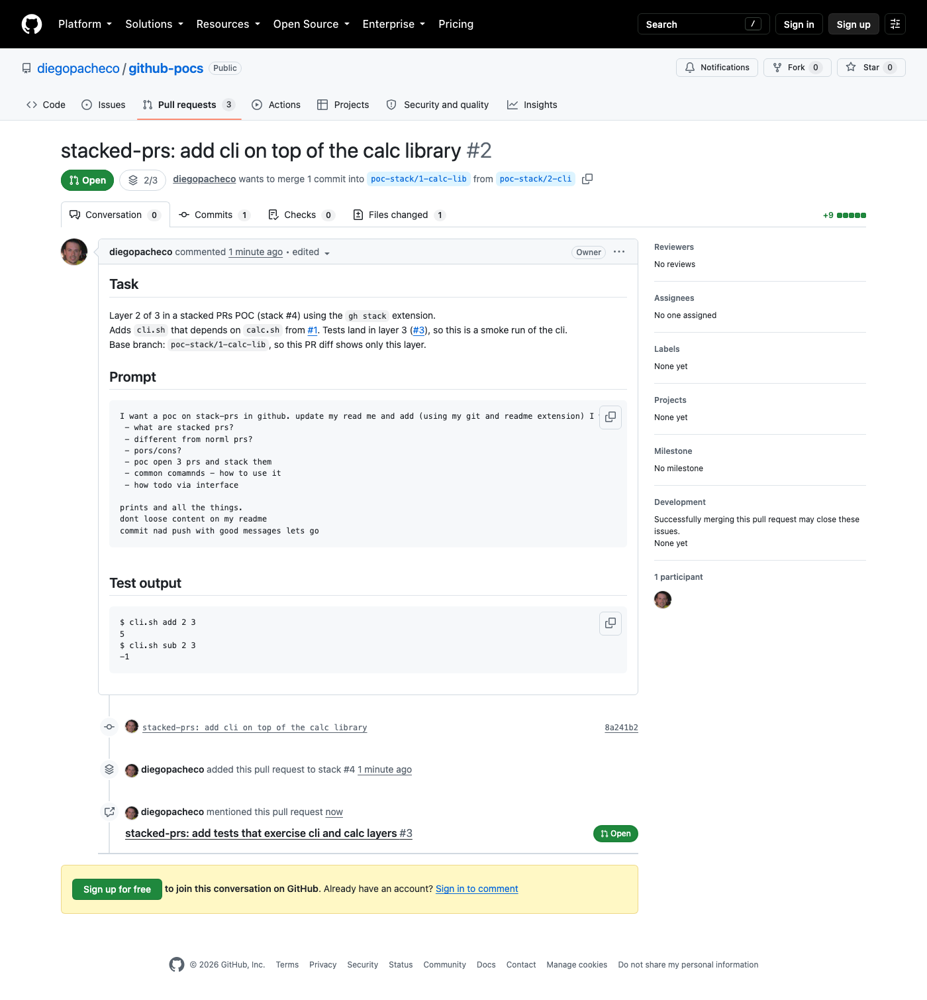
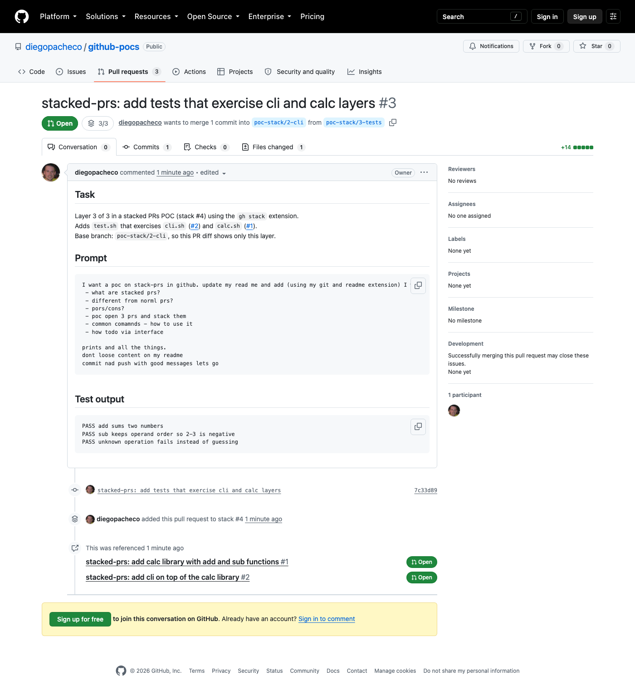
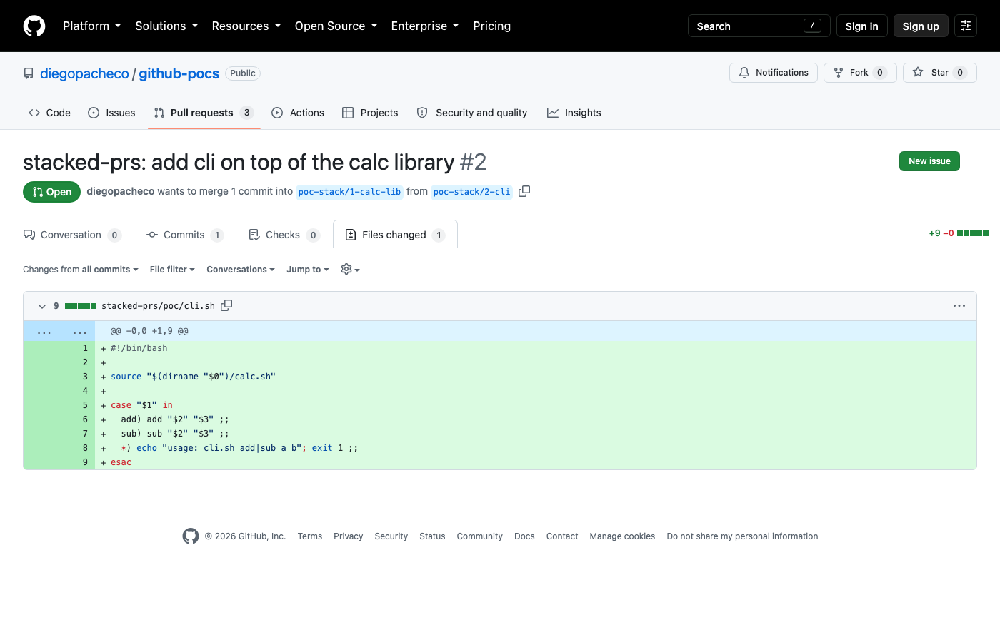

# Stack PRs

POC of GitHub stacked pull requests using the `gh stack` extension (v0.1.1). Three dependent PRs were opened and linked as one stack: a calc library, a CLI on top of it, and tests on top of the CLI.



## CLI

```
gh extension install github/gh-stack
```

## What are stacked PRs?

Stacked PRs are two or more pull requests in the same repository that form a chain:

* The bottom PR targets the trunk (usually `main`).
* Each PR above targets the branch of the PR below it.
* Each PR shows only the diff of its own layer.
* GitHub links them as one stack: a stack badge (`1/3`, `2/3`, `3/3`) on each PR, a stack map in the merge box, and a stack number (this POC is stack `#4`).

Rule of thumb: if code in one layer depends on another layer, the dependency must be in the same branch or a lower one.

## Different from normal PRs?

| | Normal PR | Stacked PRs |
|---|---|---|
| Base branch | always `main` | bottom PR is `main`, others target the PR below |
| Size | one big diff | several small diffs, one per layer |
| Waiting | next change waits for the merge | keep building on top of open PRs |
| Review | one reviewer pass over everything | each layer reviewed on its own |
| Merge | one PR at a time | bottom-up, one PR or a contiguous group in one atomic operation |
| After merge | nothing else changes | next PR is rebased and retargeted to `main` automatically |
| Rebase | manual, per branch | cascading rebase (server side or `gh stack rebase`) |
| Linking | none | GitHub knows the stack (UI, REST, GraphQL, webhooks) |

## Pros / Cons

Pros
* Small PRs are faster to review, less skimmed, and go stale less.
* You do not block on reviews, you keep stacking the next change.
* Clear dependency order: foundations at the bottom, consumers on top.
* Atomic merge of a contiguous group, all or nothing.
* GitHub does the cascading rebase and retargets the next PR after a merge.
* Works with merge queues, and fits AI agents that produce one task per PR.

Cons
* Public preview, behavior and commands can change.
* Rebase based: branches get force pushed (`--force-with-lease`) when lower layers change.
* A mid-stack PR cannot be merged alone, everything below merges with it.
* To merge a PR, every PR below needs approvals and passing checks.
* Same repository only, no cross-fork stacks, no GitHub Desktop support.
* Auto-merge is not supported for stacked PRs.
* Trunk moving ahead makes the stack non linear and requires a "Rebase stack".
* One more tool and mental model for the team.

## POC: 3 PRs stacked

| Layer | PR | Branch | Base | File |
|---|---|---|---|---|
| 3 (top) | [#3](https://github.com/diegopacheco/github-pocs/pull/3) | `poc-stack/3-tests` | `poc-stack/2-cli` | `poc/test.sh` |
| 2 | [#2](https://github.com/diegopacheco/github-pocs/pull/2) | `poc-stack/2-cli` | `poc-stack/1-calc-lib` | `poc/cli.sh` |
| 1 (bottom) | [#1](https://github.com/diegopacheco/github-pocs/pull/1) | `poc-stack/1-calc-lib` | `main` | `poc/calc.sh` |

Commands used

```bash
gh stack init poc-stack/1-calc-lib
git add stacked-prs/poc/calc.sh
git commit -m "stacked-prs: add calc library with add and sub functions"

gh stack add poc-stack/2-cli
git add stacked-prs/poc/cli.sh
git commit -m "stacked-prs: add cli on top of the calc library"

gh stack add poc-stack/3-tests
git add stacked-prs/poc/test.sh
git commit -m "stacked-prs: add tests that exercise cli and calc layers"

gh stack submit --auto --open
```

Output of `gh stack submit --auto --open`

```
Checking stack state...
Pushing to origin...
✓ Created PR #1 (https://github.com/diegopacheco/github-pocs/pull/1) for poc-stack/1-calc-lib
✓ Created PR #2 (https://github.com/diegopacheco/github-pocs/pull/2) for poc-stack/2-cli
✓ Created PR #3 (https://github.com/diegopacheco/github-pocs/pull/3) for poc-stack/3-tests
✓ Stack created on GitHub with 3 PRs (stack #4)
✓ Pushed and synced 3 branches
```

Output of `gh stack view --short`

```
Stack #4
» poc-stack/3-tests ○ #3 (https://github.com/diegopacheco/github-pocs/pull/3) (current)
├ poc-stack/2-cli ○ #2 (https://github.com/diegopacheco/github-pocs/pull/2)
├ poc-stack/1-calc-lib ○ #1 (https://github.com/diegopacheco/github-pocs/pull/1)
└ main
```

Run the POC tests

```bash
gh stack checkout 4
gh stack top
bash stacked-prs/poc/test.sh
```

```
PASS add sums two numbers
PASS sub keeps operand order so 2-3 is negative
PASS unknown operation fails instead of guessing
```

## Common commands

Create
| Command | What it does |
|---|---|
| `gh stack init b1` | start a stack with branch `b1` on top of the default branch |
| `gh stack init b1 b2 b3` | create or adopt several branches as a stack, bottom to top |
| `gh stack init --base develop b1` | use another trunk branch |
| `gh stack add b2` | new branch on top of the current stack |
| `gh stack add -Am "msg" b2` | new branch and commit all changes in one go |
| `gh stack submit` | push all branches, open/update PRs, create the stack (interactive editor) |
| `gh stack submit --auto --open` | same, no editor, PRs ready for review |
| `gh stack link 41 42 43` | stack existing PRs or branches without local tracking |

Navigate
| Command | What it does |
|---|---|
| `gh stack view` / `--short` / `--json` | show the stack and PR status |
| `gh stack up [n]` / `gh stack down [n]` | move up or down the stack |
| `gh stack top` / `gh stack bottom` / `gh stack trunk` | jump to top, bottom, or trunk |
| `gh stack switch` | interactive branch picker |
| `gh stack checkout 4` | check out stack `#4` (also accepts PR number, PR URL, branch) |

Keep in sync
| Command | What it does |
|---|---|
| `gh stack sync` | fetch, cascade rebase, push, sync PR state |
| `gh stack sync --prune` | also delete local branches of merged PRs |
| `gh stack rebase` | cascading rebase of the whole stack |
| `gh stack rebase --upstack` / `--downstack` | rebase only above or below the current branch |
| `gh stack rebase --continue` / `--abort` | after resolving conflicts, or give up |
| `gh stack push` | push active branches with `--force-with-lease` |
| `gh stack modify` | TUI to drop, fold, insert, reorder, rename branches |

Merge and cleanup
| Command | What it does |
|---|---|
| `gh stack merge` | interactive: choose how far up to merge and the merge method |
| `gh stack merge 3 --yes --squash` | merge everything up to PR #3, no prompt |
| `gh stack unstack` | remove the stack locally and on GitHub (PRs stay open) |
| `gh stack unstack --local` | remove only local tracking |

Typical flow after review feedback on a lower layer

```bash
gh stack bottom
git commit -am "stacked-prs: address review"
gh stack rebase --upstack
gh stack push
```

## How to do it via the interface

Create a stack on the GitHub website
1. Open the first PR as usual, base `main`.
2. Open the second PR and set its base branch to the first PR branch.
3. Select **Create stack** to link both PRs.
4. Repeat for each layer, always targeting the branch of the PR below.

Turn existing PRs into a stack
1. If the bases already chain (PR 2 base is PR 1 head, and so on), GitHub shows a recommendation banner.
2. Click the banner, review the preview (top to bottom), and confirm.

Add a PR to an existing stack
1. Open any PR of the stack, click the stack icon in the header, then **Add to stack**.
2. The base is set to the head of the top PR, pick your head branch, and **Create pull request**.

Merge from the interface
1. Go to the lowest unmerged PR, or a higher one to merge a contiguous group.
2. The merge box shows the status of the whole stack. Everything below needs approvals, passing checks, and linear history.
3. If a **Rebase stack** button shows up (trunk moved ahead or a lower branch changed), click it first.
4. Merge. The selected PR and all unmerged PRs below land on `main` in one operation, and the next PR is retargeted to `main`.

## Printscreens

Pull request list: the 3 PRs of the POC. Each one has a stack badge with its position in the stack: `1/3`, `2/3`, `3/3`.



PR #1, bottom of the stack: badge `1/3`, merges into `main` from `poc-stack/1-calc-lib`. The timeline shows "added this pull request to stack #4".



PR #2, middle of the stack: badge `2/3`, base is `poc-stack/1-calc-lib` instead of `main`.



PR #3, top of the stack: badge `3/3`, base is `poc-stack/2-cli`. The body has the test output of the whole stack.



PR #2 files changed: only `cli.sh` (+9). `calc.sh` from the layer below is not in the diff, which is the main point of stacking.



Printscreens were taken logged out. The stack map inside the merge box and the **Add to stack** button only show for signed-in users with access to the repository.

## References

* https://gh.io/stacks
* https://docs.github.com/en/pull-requests/get-started/about-stacked-prs
* https://docs.github.com/en/pull-requests/how-tos/create-pull-requests/creating-stacked-pull-requests
* https://docs.github.com/en/pull-requests/how-tos/merge-and-close-pull-requests/merging-stacked-pull-requests
