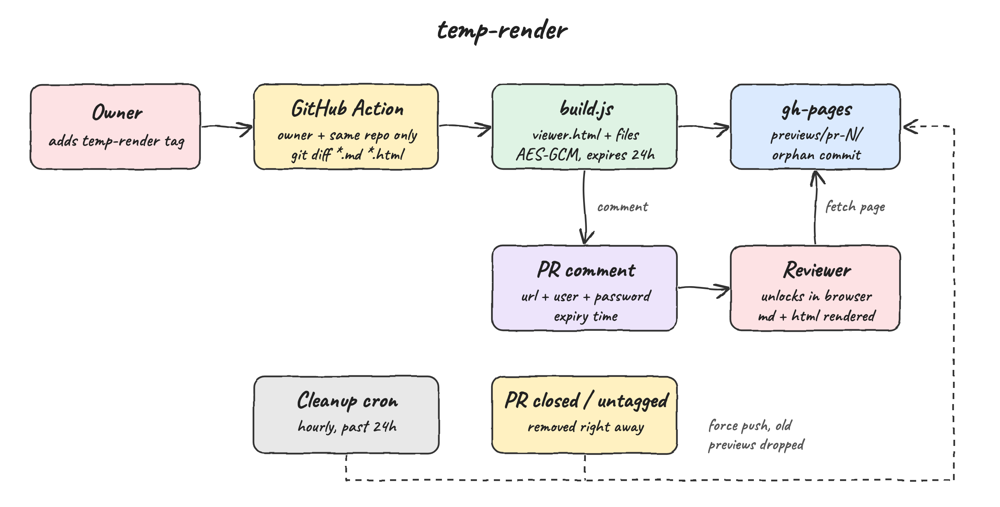
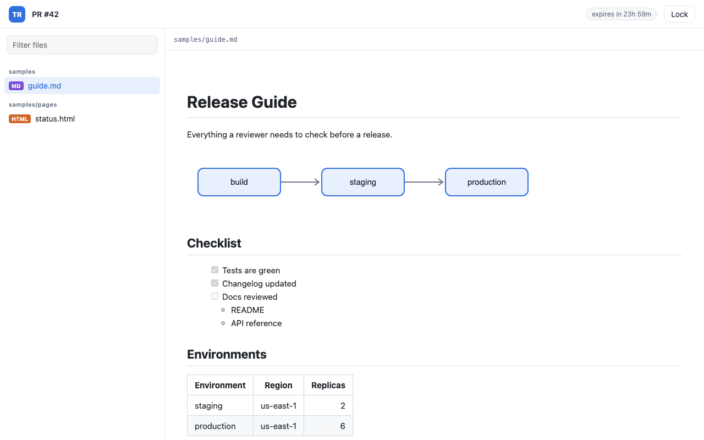
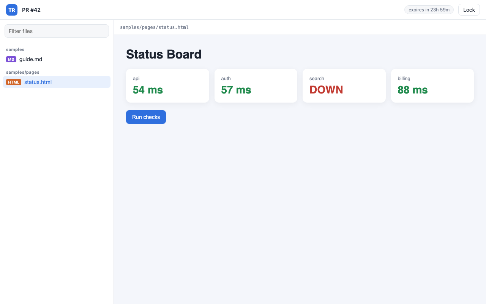
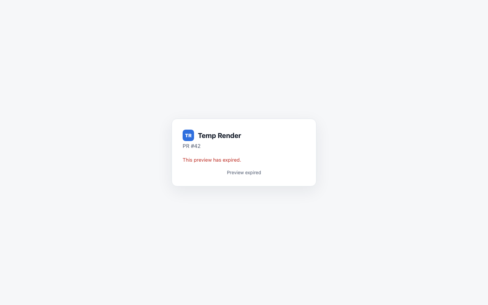

# Temp Render

Run `scripts/render-pr.sh <pr>` and a GitHub Action tags the pull request with `temp-render` and publishes a temporary page that renders every `.md` and `.html` file changed in that PR. The page is protected by a user and a one-run password that only the owner's terminal ever shows, the link is commented on the PR, and the page is deleted after 24 hours.



## How it Works

1. The repo owner runs `scripts/render-pr.sh <pr>`. It makes a random password, stores it in the `RENDER_PASS` repository secret, adds the `temp-render` label and starts the workflow with `workflow_dispatch`.
2. The workflow publishes only when the owner started it and the PR is open with its branch in this repo, not a fork. Labels and pushes never publish.
3. `git diff` between the PR base and head lists the changed `.md`, `.markdown`, `.html` and `.htm` files.
4. `src/build.js` packs those files, plus the images they reference, into one self-contained `index.html` and encrypts the content with AES-GCM using a key derived from `user:password` (PBKDF2, 310k iterations).
5. `ci/pages.sh` writes the page to `previews/pr-N/` on the `gh-pages` branch as a single orphan commit, so removed previews do not stay in git history.
6. The bot comments the URL, user and expiry on the PR, never the password. The script waits for the run, deletes the secret (also when the run fails or is interrupted) and prints the URL, user and password in the owner's terminal.
7. The owner opens the URL, types the user and password, and the browser decrypts and renders the files. After new pushes, run the script again for a new page and a new password.
8. An hourly cron removes previews older than 24h. Closing the PR or removing the label removes the preview right away.

## Architecture

| Piece | File | Role |
|---|---|---|
| Viewer | `src/viewer.html` | Login, file list, filter, renders md and html in sandboxed iframes |
| Markdown renderer | `src/markdown.js` | Zero dependency GitHub-flavored markdown to html |
| Crypto | `src/seal.js` | PBKDF2 + AES-GCM with WebCrypto, same code runs in Node and in the browser |
| Builder | `src/build.js` | Reads files, embeds images, seals, inlines everything into one page |
| Publisher | `ci/pages.sh` | `publish`, `remove`, `prune` on `gh-pages` |
| PR comment | `ci/comment.sh` | Creates or updates one bot comment |
| Trigger | `scripts/render-pr.sh` | One-run secret, label, dispatch, wait, delete secret, print password |
| Workflow | `../.github/workflows/temp-render.yml` | Owner-only dispatch, fork check, build, publish, comment, remove |
| Cleanup | `../.github/workflows/temp-render-cleanup.yml` | Hourly prune of expired previews |

The workflows live in the repo root `.github/workflows/` because GitHub only reads workflows from there.

## Features

* **Only the owner can trigger** - publishing needs `workflow_dispatch`, which needs write access, and the job also checks the actor is `github.repository_owner`. Fork PRs never publish.
* **One-run password** - every publish gets a new password that lives in a secret only while its run is going, and is only printed in the owner's terminal. The public page is only ciphertext until unlocked.
* **Dies in 24h** - hourly prune deletes the files and rewrites `gh-pages` without history, and the page itself refuses to unlock after expiry.
* **Renders md and html** - tables, task lists, nested lists, code blocks, images, raw html in markdown, and full html pages with their own JS and CSS.
* **Images embedded** - relative images referenced by the files are inlined as data URIs so the page is self-contained.
* **Links between files** - a markdown link to another rendered file opens it in the viewer.
* **Isolation** - html runs in a sandboxed iframe without same-origin, so it cannot read the decrypted content of other files.
* **No path leaks** - only repo-relative paths are published, files and images that resolve outside the repo (including symlinks) are rejected.
* **No indexing** - `robots.txt` disallows all and the page sets `noindex`.
* **No dependencies** - no npm packages, only Node, bash, git and the browser.

## Stack

* **Node 24** - runs the builder and tests with the built-in test runner.
* **WebCrypto** - same encryption API in Node and in the browser.
* **Bash + git** - publishes to `gh-pages` with plumbing commands and orphan commits.
* **GitHub Actions** - label trigger, hourly cron and PR comments with `gh`.
* **GitHub Pages** - static hosting for the encrypted page.
* **Vanilla HTML, CSS and JS** - the viewer is one file with no libraries.

## Contracts

Builder CLI:

```bash
node src/build.js --root <repo> --out <dir> --user <user> --pass <password> \
  --hours 24 --title "PR #12" [--files-from <nul-separated-list>] [files...]
```

Writes `<dir>/index.html` and `<dir>/expires-at` (epoch seconds).

Publisher:

```bash
ci/pages.sh publish pr-12 <dir>
ci/pages.sh remove pr-12
ci/pages.sh prune
```

Preview URL: `https://<owner>.github.io/<repo>/previews/pr-<number>/`

## Key Design Decisions

* **Encryption instead of server auth** - GitHub Pages has no basic auth, so the page ships as ciphertext and the browser decrypts it. Nothing else to host and no extra accounts.
* **Orphan commit on every change** - `gh-pages` always has one commit, so an expired preview is really gone from the branch, not only from the latest tree.
* **Payload shape** - `{ title, expiresAt, sealed: { iterations, salt, iv, data } }`, where `data` decrypts to `{ files: [{ path, type, content }], assets: { path: dataUri } }`.
* **Shared global scope** - `seal.js`, `markdown.js` and the viewer script are inlined into one page, a test fails if they declare the same top level name.

## Security Notes

* **Password never public** - PR comments, workflow logs, job summaries and artifacts are public in a public repo, so the password is never written to any of them. It lives in the `RENDER_PASS` secret only during its run, GitHub masks it in logs and never passes secrets to fork PRs.
* **Forks get nothing** - a fork copies files and history, not secrets, and its runs use its own token that cannot write to this repo.
* **One password per run** - a leaked password opens one preview, for at most 24h.
* **Stuck secret** - if the script cannot delete the secret it fails with the `gh secret delete RENDER_PASS` command to run.
* **Expiry window** - the hourly cron plus the GitHub Pages cache means files can be served for up to about 1h 10m after 24h. The page itself refuses to unlock at exactly 24h.
* **Copies** - anyone who unlocked the page or fetched `gh-pages` before prune can keep a copy.
* **Owner only** - `github.repository_owner` is a user for personal repos. For an organization repo change the check to a user login.

## GitHub Setup (not done yet)

1. Create the `temp-render` label.
2. Push this code so the workflows exist on the default branch, `workflow_dispatch` only works from there.
3. Settings, Actions, General: allow workflows read and write permissions.
4. Run `./scripts/render-pr.sh <pr>` once, then enable GitHub Pages from the `gh-pages` branch, root folder.

## Printscreens

Markdown file rendered after unlocking: headings, embedded image, task list with nested items and an aligned table. The left side lists every changed file grouped by folder, with an expiry countdown on top.



HTML file rendered with its own CSS and JavaScript inside a sandboxed iframe. It was opened by clicking a link inside the markdown file.



After 24 hours the page refuses to unlock and hides the login form.



## Tests

```bash
./scripts/test-all.sh
```

35 tests cover markdown rendering, encryption round trips and wrong credentials, path leak and symlink rejection, expiry, payload escaping, `gh-pages` publish, remove and prune against a local bare repo, duplicate global names, and `render-pr.sh` against a fake `gh`: the secret is deleted after success and failure, every run gets a new password, and bad input never reaches GitHub.

## Scripts

All scripts live in `scripts/` and run from any directory of the repository.

| Script | What it does |
|---|---|
| `./scripts/setup.sh` | Checks node, python3, git and lsof, nothing to install |
| `./scripts/start-all.sh` | Builds the files in `samples/` with a random password and serves them, prints the user, password and link |
| `./scripts/status.sh` | Shows the viewer port as UP or DOWN |
| `./scripts/render-pr.sh <pr>` | Publishes a preview of a PR with a one-run password, prints the link and password |
| `./scripts/test-all.sh` | Runs every test suite |
| `./scripts/ui.sh` | Opens the viewer in the browser |
| `./scripts/stop-all.sh` | Stops the viewer |

Ports are declared in `scripts/ports.env`.

```bash
./scripts/setup.sh
./scripts/start-all.sh
./scripts/status.sh
./scripts/ui.sh
./scripts/stop-all.sh
```
