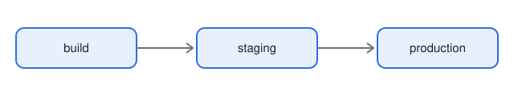

# Temp Render Test

This page checks that the PR preview renders markdown.

## Checklist

- [x] Markdown heading
- [x] Task list
  - [ ] Nested item
- [ ] Table below

## Table

| Item | Status | Owner |
|:---|:---:|---:|
| Render md | ok | diego |
| Render html | ok | diego |

## Code

```bash
./scripts/render-pr.sh 1
```

## Image



Open the [html page](page.html) next.
